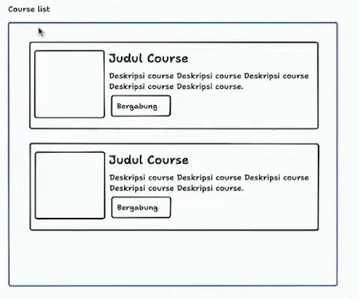
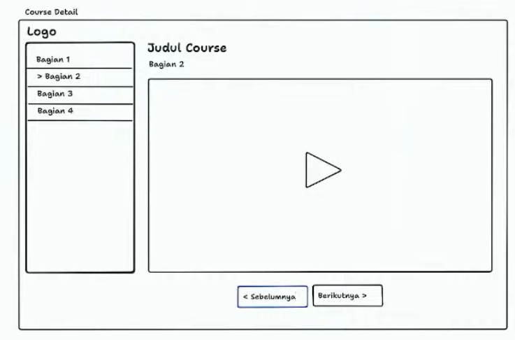

# Sveltern

Learning management system build with Sveltekit and Pocketbase.

We do build in public style in livestreaming format. Follow along video:
[](https://youtube.com/watch?v=rECkmhMt4no)

[](https://youtube.com/watch?v=UmbJdEww9S0)

## Brainstorming

### Functional requirements

- As a user, I can see list of coures, so I can learn or take the course
- As a user, I can see the detail course, so I can learn from the material or video

### Non-functional requirements

- Using Sveltekit as frontend of the application
- Using Pocketbase as the backend
- Using open-props
- Deployment (TBD)

### High-level design

#### Course Index



#### Course detail



### Models

- courses
    - id
    - title
    - description
    - thumbnail
    
- chapters
    - id
    - title
    - description
    - video_url
    - order
    
- categories (TBD)


## Getting started

Run pocketbase first:

``` bash
$ ./pocketbase serve
```

Run Sveltekit in dev mode

``` bash
$ npm run dev # or pnpm dev
```

## TODO

- [x] Install styling library
- [x] Layout with open-props
- [x] Card for courses
- [ ] Fitur realtime dengan pocketbase subscribe
- [ ] Detail page
- [ ] Deploy
- [ ] Form upload content (tentative)
- [ ] Auth (tentative)

## Prompts GPT

-  Create layout in html and css with header, main and footer
